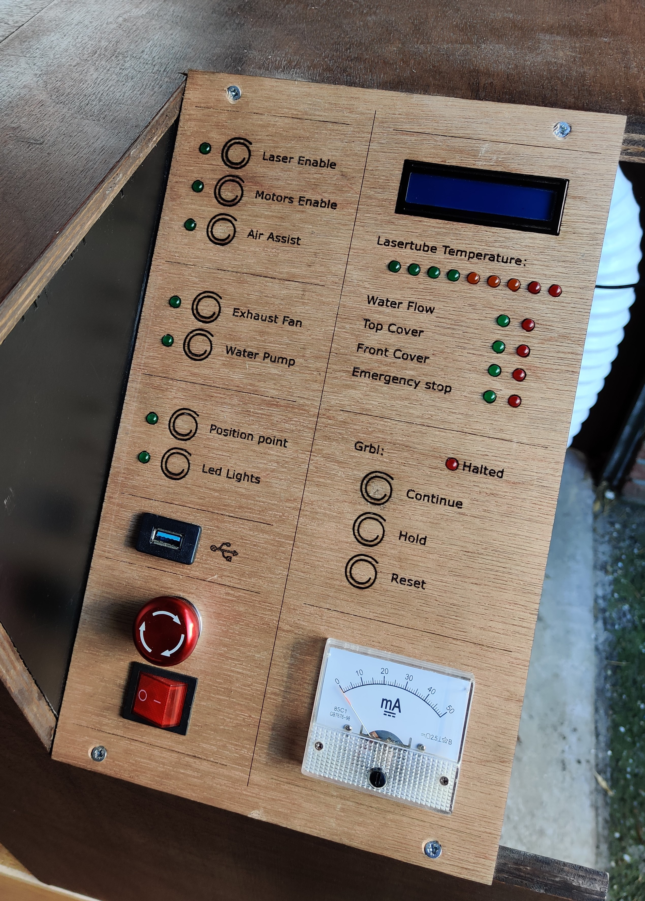
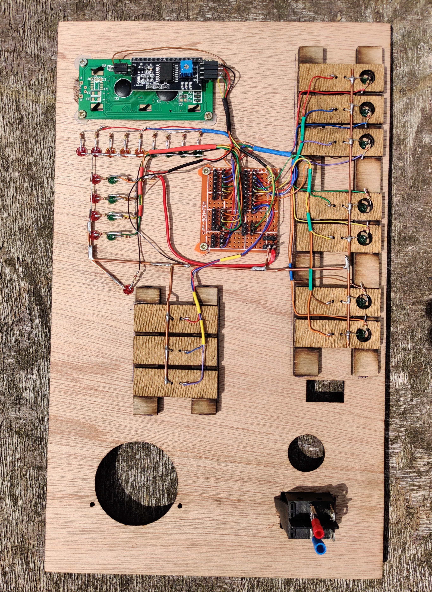
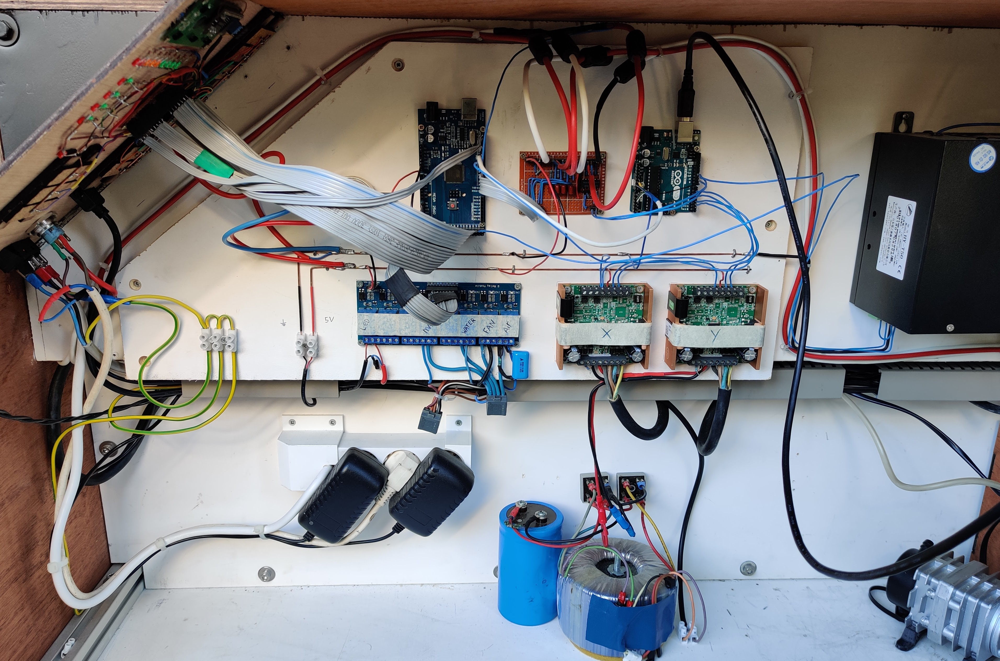

# Laser Control panel

An intuitive interface for grbl Laser Cutters with automated safety monitoring using an arduino Mega

## Features

- Automatic halting grbl when safety is compromized (like lid opened, tube too hot, water stopped flowing, emergency stop triggered)
- Laser can only be enabled is all safety is met
- Physical buttons to pause and resume a job
- Screen and lightbar to monitor laser tube temprature

<table>
  <tr>
    <th> Laser Contol Panel IRL </th>
    <th> Demo of automatic halting as lid opens </th>
  </tr>
  <tr>
    <td>  </td>
    <td>  </td>
  </tr>
</table>

## Wiring the arduino mega

### Output control buttons

| Item                      | button pin | led pin | output pin | output type                                |
|---------------------------|------------|---------|------------|--------------------------------------------|
| Laser enable              | 35         | 24      | 22         | Direct connection to laser PSU             |
| Stepper motor enable      | 37         | 26      | 8          | Direct connection to stepper driver        |
| Air assist enable         | 39         | 28      | A8         | Relay board                                |
| Exhaust fan               | 41         | 30      | A9         | Relay board                                |
| Water cooling pump        | 43         | 32      | A10        | Relay board                                |
| Position indication light | 45         | 34      | 7          | Direct connection powering 5v laser diodes |
| Internal lighting         | 47         | 36      | A15        | Relay board                                |

### GRBL controls

| Item       | button input pin | output signal pin |
|------------|------------------|-------------------|
| Continue   | 49               | 9                 |
| Feed hold  | 51               | 11                |
| Soft reset | 53               | 10                |

``` text
Halted indicator led  --> pin 46  
GRBL stepper control output ( GRBL pin 8) --> pin 12
```

### Safety input signal

| Item                    | input pin | status led pin |
|-------------------------|-----------|----------------|
| Cooling water flow      | 4         | 38             |
| Top door/cover switch   | 5         | 40             |
| Front door/cover switch | 6         | 42             |
| Emergency stop          | 3         | 44             |

### Temperature monitoring

``` text
Temperature leds:
red     --> 48
orange  --> 50
green   --> 52

ds18b20 one wire bus  --> 2
```

### Others

``` text
Relay control main power in  --> pin A12

LCD-screen with i2c backpack is connected --> at scl and sda  
Screen backlight --> pin 13
```

## Wiring

<table>
  <tr>
    <th> Wiring buttons and leds etc </th>
    <th> Laser cutter wiring </th>
  </tr>
  <tr>
    <td>  </td>
    <td>  </td>
  </tr>
</table>

If you would like some schematics open an issue and i might put some time into that. But i expect most of it to be straight forward enough, and you might need to modify some stuff to best suit your machine.